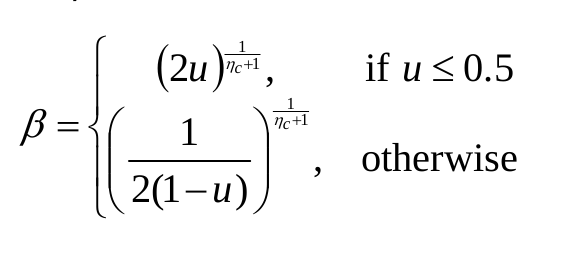
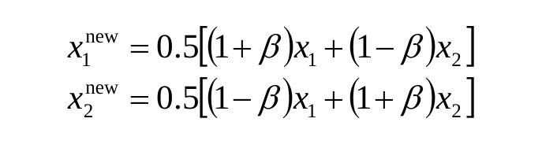

# Genetic-Algorithms
Given coefficients of features corresponding to an overfit model the task is to apply genetic algorithms in order to reduce the overfitting.

## Given paramenters

Vector size: `11` <br>
Valid range of values: `[-10 , 10]`

## Genetic Algorithms

## Algorithm Version One
// I call it The Rudimentary Bakwaas.

Parameters used: 

Population size: `100` <br>
Mating pool size: `20` <br>
Train factor: `0.7`

### Creating the first population

The first population is created using the overfit vector. `100` copies of the overfit vector were made. `99` of these vectors are mutated to generate a population.

The mutation is done by using the `random.randint()` function to generate a random valid index for each vector. Then `random.uniform()` is used to generate a floating point number in the valid range for the same vector and the value at the random index is changed to the random float value.

```python
first_population = [np.copy(first_parent) for i in range(POPULATION_SIZE)]
for i in range(POPULATION_SIZE - 1):
    index = random.randint(0, VECTOR_SIZE - 1)
    first_population[i][index] = random.uniform(-10, 10)
```

### Fitness of the population 

In the fitness function, `get_errors` requests are sent to obtain the train error and validation error for every vector in the population.

The fitness corresponding to that vector is then calculated as <br>
`Train Error * Train Factor + Validation Error`

```python
for i in range(POPULATION_SIZE):
    error = get_errors(SECRET_KEY, list(population[i]))
    fitness[i] = abs(error[0]*train_factor + error[1])
```

### Selection of mating pool 

Once a population is generated, a new population is generated by using the latest generated population. Hence a mating pool must be selected from the latest generation. This is done by sorting the population vectors based on their corresponding fitness.

The top vectors are chosen into the mating pool
```python
# population_fitness is the list of all vector and their corresponding fitness
    population_fitness = population_fitness[np.argsort(population_fitness[:,-1])]
    mating_pool = population_fitness[:MATING_POOL_SIZE]
```

### Crossover to generate children

To generate each vector in the new generation, two parents are randomly chosen from the mating pool using `random.randint()`. These parents undergo crossover to generate one child. The child vector is then mutated before appending to the new generation.

 for i in range(POPULATION_SIZE):
    parent1 = mating_pool[random.randint(0, MATING_POOL_SIZE-1)]
    parent2 = mating_pool[random.randint(0, MATING_POOL_SIZE-1)]
    child = crossover(parent1, parent2)
    child = mutation(child)
    children.append(child)

The crossover is done by choosing a random valid index using `random.randint()` and then cutting both parents at that crossover point. The first section of the first parent and the second cut part from the second parent are appended together to form the child.

```python
child = np.empty(VECTOR_SIZE)
crossover_point = random.randint(0, VECTOR_SIZE)
child[:crossover_point] = parent1[:crossover_point]
child[crossover_point:] = parent2[crossover_point:]
```

### Mutation 

The new generation undergoes mutation similar to what is done for the initial population. 

The mutation is done by using the `random.randint()` function to generate a random valid index for each vector. Then `random.uniform()` is used to generate a floating point number in the valid range for the same vector and the value at the random index is changed to the random float value.

```python
for i in range(POPULATION_SIZE):
    mutation_index = random.randint(0, VECTOR_SIZE - 1)
    population[i][mutation_index] = random.uniform(-10, 10) 
```


### Creating subsequent populations 

A new population is created by selecting `80` best children generated by the previous population and `20` best parents from the previous population after sorting the vector according to their fitness values.

### Diagram 
// Vaibhav mail says make diagram, got to see tommorrow


// All your kinky modifications should prolly come here as Algorithm Version 2, 3, 4 and so on


## Algorithm Version One Millionth
// I call it The S BC.

Parameters used: 

Population size: `30` <br>
Mating pool size: `10` <br>
Distribution factor: `4` 


### Creating the first population

The first population is created using the overfit vector. `100` copies of the overfit vector were made. All `100` of these vectors are mutated to generate a population.

The mutation is done by selection of a random valid index to mutate using the `random.randint()` function. A random float `m` is then obtained using the `random.uniform()` function. 

Next, a number `vary` is set to a random float in the range of `[-m, m] + 1`. Finally vary is multiplied to the float at the chosen index iff the multiplication results in a float within valid range. Else the value at the chosen index is set to a float in the range `[-1, 1]`

```python
first_population = [np.copy(first_parent) for i in range(POPULATION_SIZE)]
for i in range(POPULATION_SIZE):
    index = random.randint(0,10)
    m = random.uniform(0, 0.0006)
    vary = 1 + random.uniform(-m, m)
    rem = first_population[i][index]*vary
    if abs(rem) <= 10:
        first_population[i][index] = rem
    else:
        first_population[i][index] = random.uniform(-1,1)
```

### Fitness of the population 

In the fitness function, `get_errors` requests are sent to obtain the train error and validation error for every vector in the population.

The fitness corresponding to that vector is then calculated as <br>
`Train Error  + Validation Error`

```python
for i in range(POPULATION_SIZE):
    error = get_errors(SECRET_KEY, list(population[i]))
    fitness[i] = abs(error[0] + error[1])
```

### Selection of mating pool 

Selection is done by sorting the population vectors based on their corresponding fitness.

The top vectors are chosen into the mating pool.
```python
# population_fitness is the list of all vector and their corresponding fitness
    population_fitness = population_fitness[np.argsort(population_fitness[:,-1])]
    mating_pool = population_fitness[:MATING_POOL_SIZE]
```
### Crossover to generate children

To generate each vector in the new generation, two parents are randomly chosen from the mating pool using `random.randint()`. These parents undergo crossover to generate two children. The child vectors are then mutated before appending to the new generation.

```python
for i in range( int(POPULATION_SIZE/2)):
    parent1 = mating_pool[random.randint(0, MATING_POOL_SIZE-1)]
    parent2 = mating_pool[random.randint(0, MATING_POOL_SIZE-1)]
    child1, child2 = crossover(parent1, parent2)
```
The entire idea behind simulated binary crossover is to generate two children from two parents, satisfying the following equation. All while being able to control the variation between the parents and children using the distric=bution index value.

<div style="text-align:center;"></div>

The crossover is done by choosing a random number in the range `[0, 1)`. The distribution index is assigned its value and then $\beta$ is calculated as follows:



Distribution index that determines how far children go from parents. The greater its value the closer the children are to parents. The distribution index is a value between `[2, 5]`.
    
Then the offsprings are calculated as follows: 



### Mutation

The mutation is done by using the `random.randint()` function to generate a random valid mutation index for the vector. Then `vary` is set to a random float in the range `[-0.005, 0.005] + 1`.

`vary` is multiplied to the float at the chosen index iff the multiplication results in a float within valid range.

```python
mutation_index = random.randint(0, VECTOR_SIZE-1)
vary = 1 + random.uniform(-0.005, 0.005)
rem = child[mutation_index]*vary
if abs(rem) <= 10:
    child[mutation_index] = rem
```

### Creating subsequent populations

A new population is created by selecting `22` best children generated by the previous population and `8` best parents from the previous population after sorting the vector according to their fitness values.

### Diagram
// Must see 

